# Intro to HTML and CSS

Create a website of your favorite singer 
Goal: Students will learn how to build their first web page using HTML and CSS. 

INTRO - 6 mins

What is HTML? 

HTML is defined as HyperText Markup Language. An HTML web page is made up of code, which displays in a web browser to show us text, images, navigation menus, video, audio, and many other things.

Teacher Says: Now let’s take a look at the HTML of a finished webpage. 
Open up https://www.upperlinecode.com/ 
Click on source code and show students the HTML of the webpage. The code can be found here: 

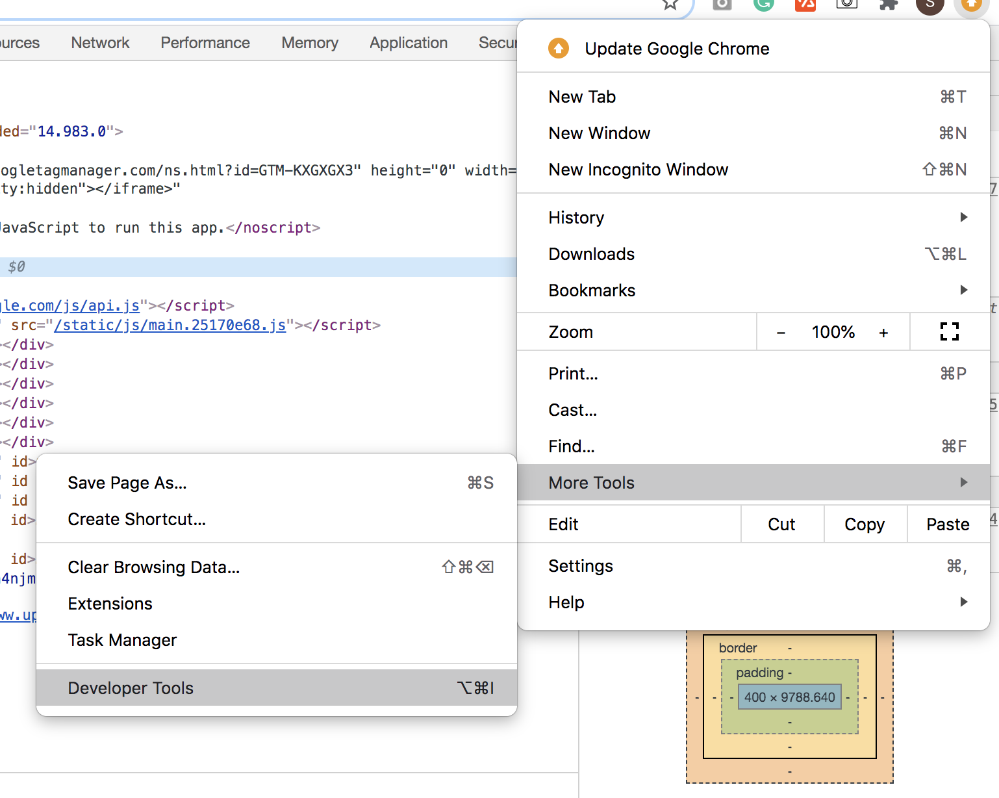

Explain to students that this code makes up the entire website.

Teacher Says: When it comes to creating the website you first want to make sure you know the layout and design(colors, text images and more) of the website. Here is an example of a webpage without any content: 

Explain this image using the Upperline code website as an example. 

Playtime 1 - 10 mins

Hand students a blank piece of paper. 
Teacher Says: For this lesson, we will be creating a website for your favorite singer. 
Name of Singer
Name of a favorite song from the artist and add favorite lyrics from the song
List of:
   Birthday
   Hometown
   Age 
  Number of albums
  Rewards

On the other side of the paper have students draw out a mockup of what they think their website will look like once they have listed all of their content. 

HTML Web Page Structure - 10 mins

Direct students to https://repl.it
Teacher Syas: We will now code out the structure of our HTML website. This will include the head, title, and body.

Head- Surrounds important content that is invisible to the user, but is important to the browser. Elements within this tag contain metadata about the page and links to stylesheets, scripts, etc.

Title- Name of your webpage, will not appear on the screen 

Body- Container for all of a page’s content. Comes after the <head> tag, within the overall <html> tag.
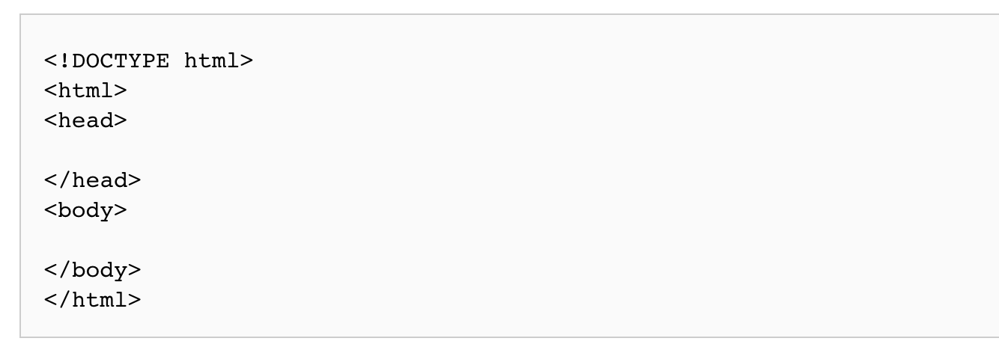

Once students have open repl.it have student code along the with you as you type in the following image including a title. 

Everyone’s code should look like this: 
<!DOCTYPE html>
<html>
  <head>
    <title> Web Page </title>
  </head>
  <body>
      </body>
</html>

ADDING HEADERS AND LIST - 10 mins

Everything that is added to the body of your website will be displayed. We will now add your first header title, image, paragraph, and list to your webpage. 

Here is an example of a top-level heading tag will look: 
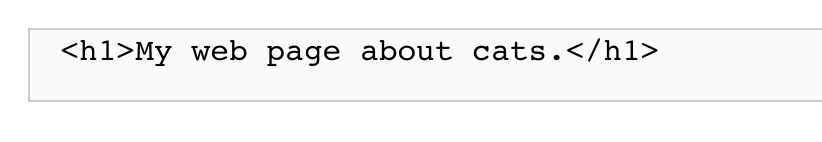

Paragraphs make up a lot of the text on webpages. Here is how a paragraph tag could look:
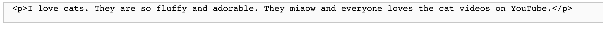

Playtime 2 - 5 mins

Add your header title “Singer’s Name”
In the paragraph tag add favorite song and lyrics

Playtime 3 - 2 mins

Challenge students to: 
Add a second header level to the song title.

Your webpage should look similar to this: 

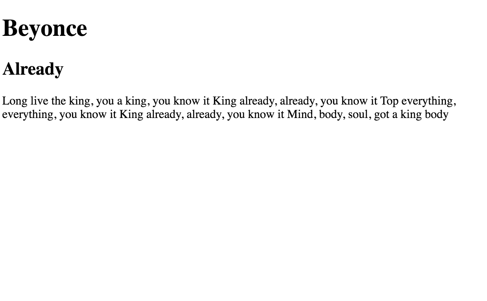

Now let’s add an image. 
Some tags, such as image tags don't have closing tags - these would appear like this:
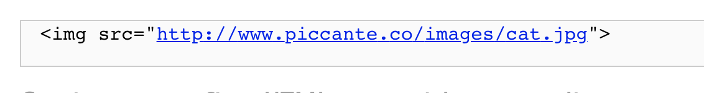

Adding list
There are different types of list. You have an order and an unordered list. 

Teacher Says: What do you think is the difference between an order list and an unorder list? 
Exemplar Answer: Ordered list has numbers and unorder list is bullet points. 

Example of ordered list:
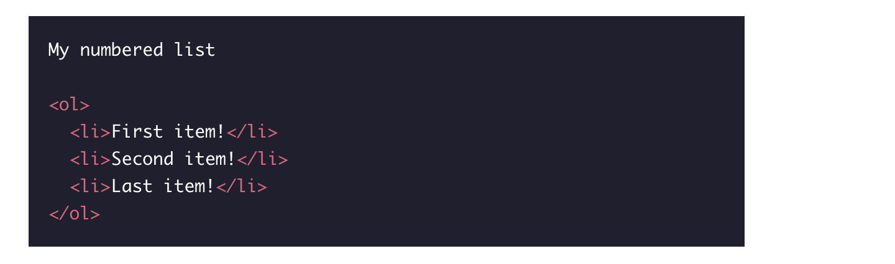

Example of unordered list:

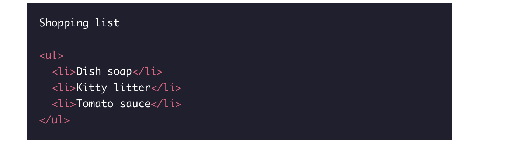

All list should start with a list tag - Example:
<li>cat</li>
<li>dog</li>
<li>fish</li>

Playtime - 5 mins
Add an image of your favorite artist 
Add an unodered list of the the list you made up of the singer on to your web page. 

Does your webpage look something like this? If so GREAT!

INTRO TO CSS

CSS(cascading stylesheet) -  this is the style of your website. It gives your websites some character. You can add different fonts, colors, and more to design your website. 

Look at this example of a website with and without CSS:

Let’s add a bit of CSS to your webpage.
 
Teacher Says: Looking at your web page what do you think you can add CSS to? 
Exemplar Answers: Background, Header Text, Paragraph, List

Direct students to their stylesheet in repl.it. They style sheet should be to the left of the screen “ style.css”. Once students open the stylesheet it should be a blank. 

For this section students will add colors, size and font to their webpage. Explain to students they are desingiing their web page to add style and personality to their website. 

Adding color to your background: 

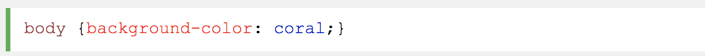

Ask students: What do you think this CSS tag does? 
Have students test out this code. 

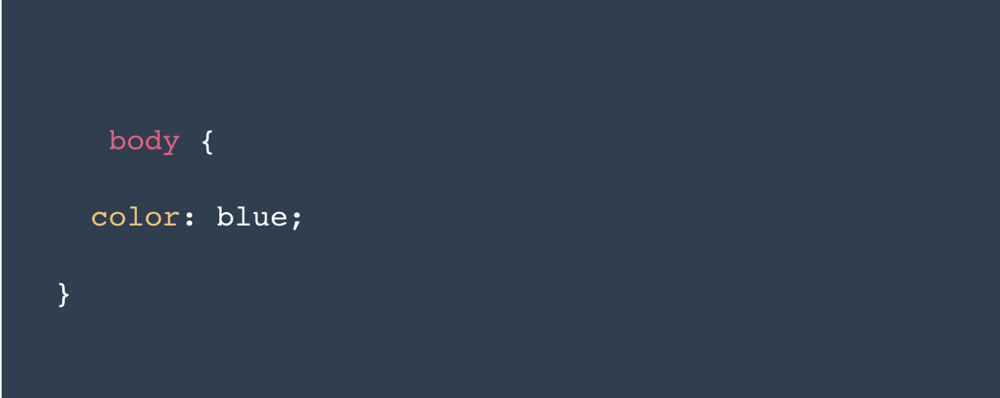

Exemplar Answer: Changes the color of all the text in your body. 

Playtime - 5 mins
Add a color to your background
Add a color to your h1
Add a color to h2
Add a color to your ordered list

Link to finish webpage - https://repl.it/@Shadeira/DefenselessLegitimateStruct#index.html
Take a look at your finished website!
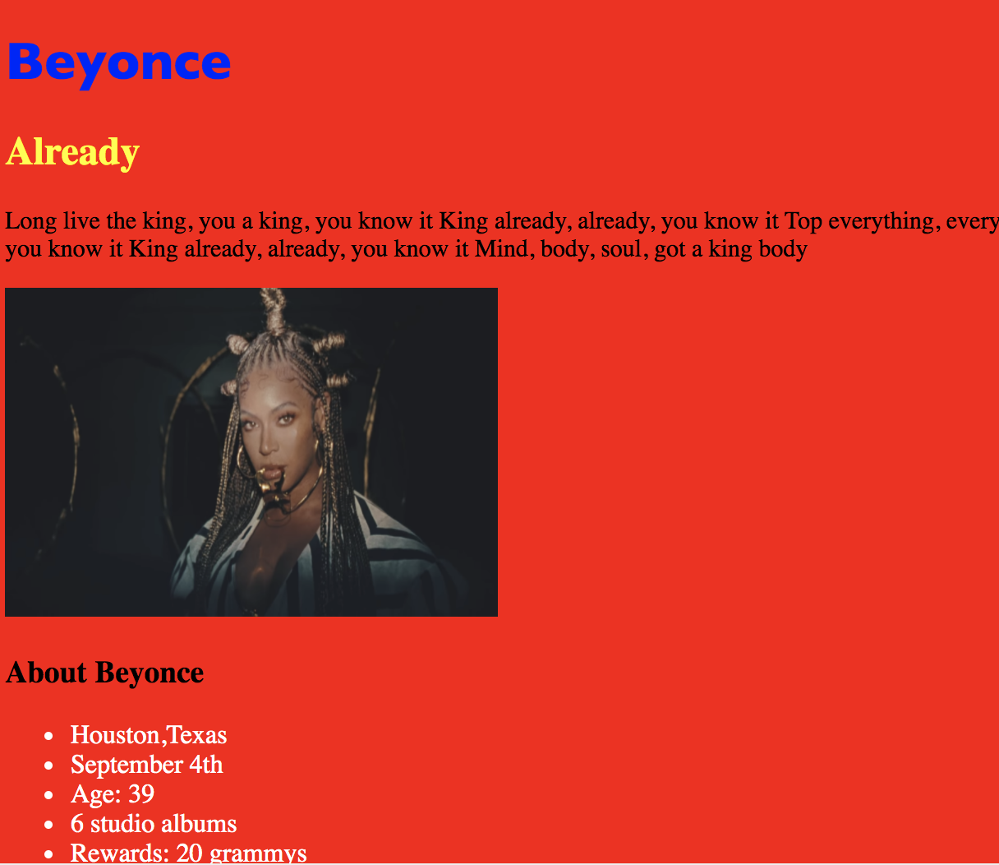

Playtime- 20mins
Challenge students to do any/all of the following:
Add a font size to your pragraph. 
Add a font family to your h1.
Add an image of each album cover inside your ordered list.
Add a link to the rest of the song lyrics
Takeaways
HTML -Creating basic html website 
HTML - Add images to a website
HMTL - Understanding the difference between an ordered and unordered list
CSS- Adding colors to a stylesheet 
